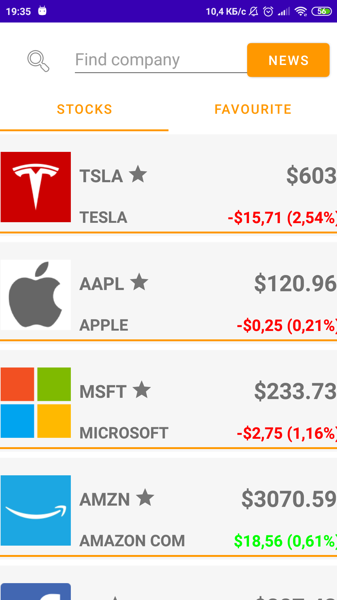

АКЦИО
=====================
yandexMobileShcool
-----------------------------------

**Дорогой проверяющий !**  
 if ( you ==  "Артур Василов" ){
     
 }  
Я Тихонов Павел студент второго курса.  
Только начинаю разрабатывать приложения на андроид. 
Разработка приложения заняла примерно 2 недели.  
Моё приложение получилось совсем не идеальное ( .  
В нём по прежнему остались баги:  
__иногда вылетает (  
__всё ещё осталась проблема с api , т.к. иногда приложение не загружается в связи с слишком большим количеством запросов.  
__и ещё несколько странных ошибок.
Во время разработки возникало ОЧЕНЬ много вопросов.  
Почти все мне удавалось правильно решить , но некоторые так и остались "костылями".  
Верся 1.1.1 является самой стабильной

Пару скриншотов моего приложения:  
   
 
 

  
**PS.**  
Надеюсь после прохождения Яндекс школы я смогу клепать такие приложения на раз-два и без ошибок и костылей 😄
 
